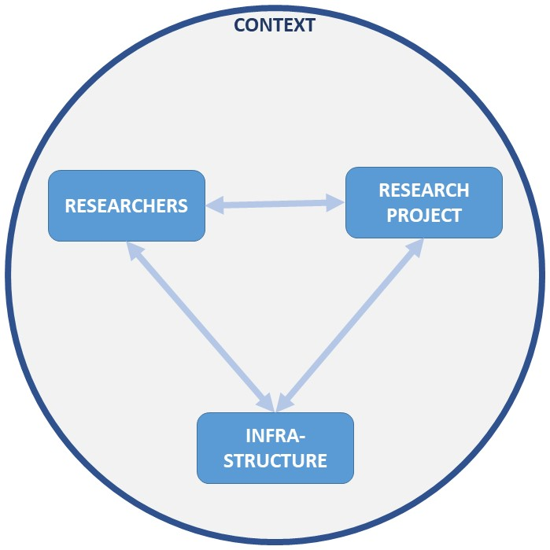

```{css, echo=FALSE}
/* THIS IS THE STYLING OF THE HTML */ 
  
/* collapsable sources with buttons */
.collapse.in {
  background-color: #f6f6f6;
}

button {
  float: right;
}

thead {
  background-color: #f6f6f6;
}


/* Styling headers */
th {
  background-color: #f6f6f6 !important;
}

h1 {
  margin: 50px 0 0 -50px !important;
}

.section.level1.vertical-layout-fill.dashboard-row-orientation {
  margin: 0 5% 0 5% !important;
}


/* Table of Contents */
.tocify-subheader>li {
  background-color: #f6f6f6;
  border-bottom: solid 1px #ececec;
  padding-left: 50px !important;
}

#TOC {
    margin: 25px 0px 0px -10px !important;
}

.tocify-subheader {
    text-indent: -20px !important;
    padding-left: 0 !important;
}
```

```{r setup, echo=F, message=F, warning=F, comment=F}
knitr::opts_chunk$set(echo = T, message = F, warning = F)
library(dplyr)
library(kableExtra)
```

\
\
\


# General 

## Working Title

<button data-toggle="collapse" data-target="#wt">more info</button>
<div id="wt" class="collapse">

```{r }
# avoiding markdown tables because they're not exactly the prettiest flower in the bunch
# set up the table
table_sources <- data.frame(Source = c("PRISMA-P",     # first column will be always the same
                                       "PROSPERO", 
                                       "MARS"),
                            Description = c(# PRISMA-P
                                            "Identify the report as a protocol of a systematic review. If the protocol is for an update of a previous systematic review, identify as such.",
                                            # PROSPERO
                                            "Give the working title of the review, for example the one used for obtaining funding. Ideally the title should state succinctly the interventions or exposures being reviewed and the associated health or social problems. Where appropriate, the title should use the PI(E)COS structure to contain information on the Participants, Intervention (or Exposure) and Comparison groups, the Outcomes to be measured and Study designs to be included. For reviews in languages other than English, this field should be used to enter the title in the language of the review. This will be displayed together with the English language title.",
                                            # MARS
                                            "Title: State the research question and type of research synthesis (e.g., narrative synthesis, meta-analysis)."))

# produce table
knitr::kable(table_sources) %>%
    kable_styling(fixed_thead = T, full_width = T) %>%
    column_spec(1, bold = T) %>%
    row_spec(0, background = "#ececec")
```

</div> 

Barriers and facilitators to sharing and reusing video research data


## Type of Review

<button data-toggle="collapse" data-target="#typeor">more info</button>
<div id="typeor" class="collapse">

```{r}
# avoiding markdown tables because they're not exactly the prettiest flower in the bunch
# set up the table
table_sources <- data.frame(Source = c("PRISMA-P",     # first column will be always the same
                                       "PROSPERO", 
                                       "MARS"),
                            Description = c(# PRISMA-P
                                            "Not specified.",
                                            # PROSPERO
                                            "Type and method of review: Select the type of review and the review method from the lists below. Select the health area(s) of interest for your review.

* Meta-analysis
* Narrative synthesis
* Network meta-analysis
* Review of reviews
* Synthesis of qualitative studies
* Systematic review
* Other",
                                            # MARS
                                            "Not specified."))

# produce table
knitr::kable(table_sources) %>%
    kable_styling(fixed_thead = T, full_width = T) %>%
    column_spec(1, bold = T) %>%
    row_spec(0, background = "#ececec")
```

</div> 

Systematic Review


## Anticipated Start and Completion Date

<button data-toggle="collapse" data-target="#aasd">more info</button>
<div id="aasd" class="collapse">

```{r}
# avoiding markdown tables because they're not exactly the prettiest flower in the bunch
# set up the table
table_sources <- data.frame(Source = c("PRISMA-P",     # first column will be always the same
                                       "PROSPERO", 
                                       "MARS"),
                            Description = c(# PRISMA-P
                                            "Not specified.",
                                            # PROSPERO
                                            "Give the date when the systematic review commenced, or is expected to commence. Give the date by which the review is expected to be completed.",
                                            # MARS
                                            "Not specified."))

# produce table
knitr::kable(table_sources) %>%
    kable_styling(fixed_thead = T, full_width = T) %>%
    column_spec(1, bold = T) %>%
    row_spec(0, background = "#ececec")
```

</div> 

* Starting: September 1, 2023
* Anticipated completion date: December 20, 2023 (without manuscript)


## Stage of Synthesis

<button data-toggle="collapse" data-target="#sor">more info</button>
<div id="sor" class="collapse">

```{r}
# avoiding markdown tables because they're not exactly the prettiest flower in the bunch
# set up the table
table_sources <- data.frame(Source = c("PRISMA-P",     # first column will be always the same
                                       "PROSPERO", 
                                       "MARS"),
                            Description = c(# PRISMA-P
                                            "Not specified.",
                                            # PROSPERO
                                            "Indicate the stage of progress of the review by ticking the relevant Started and Completed boxes. Additional
information may be added in the free text box provided.
Please note: Reviews that have progressed beyond the point of completing data extraction at the time of
initial registration are not eligible for inclusion in PROSPERO. Should evidence of incorrect status and/or
completion date being supplied at the time of submission come to light, the content of the PROSPERO
record will be removed leaving only the title and named contact details and a statement that inaccuracies in
the stage of the review date had been identified.
This field should be updated when any amendments are made to a published record and on completion and
publication of the review. If this field was pre-populated from the initial screening questions then you are not
able to edit it until the record is published.

* The review has not yet started: [yes/no]

| Review stage | Started | Completed |
|:--------------------------------------------| :----:| :----:|
| Preliminary searches | Yes/No | Yes/No
| Piloting of the study selection process | Yes/No | Yes/No
| Formal screening of search results against eligibility criteria | Yes/No | Yes/No
| Data extraction | Yes/No | Yes/No
| Risk of bias (quality) assessment | Yes/No | Yes/No
| Data analysis | Yes/No | Yes/No

Provide any other relevant information about the stage of the review here (e.g. Funded proposal, protocol not
yet finalised).",
                                            # MARS
                                            "Not specified."))

# produce table
knitr::kable(table_sources, escape = F) %>%
    kable_styling(fixed_thead = T, full_width = T) %>%
    column_spec(1, bold = T) %>%
    row_spec(0, background = "#ececec")
```

</div> 

The review has not yet started: yes

| Review stage | Started | Completed |
|:--------------------------------------------| :----:| :----:|
| Preliminary searches | Yes | No
| Piloting of the study selection process | No | No
| Formal screening of search results against eligibility criteria | No | No
| Data extraction | No | No
| Risk of bias (quality) assessment | No | No
| Data analysis | No | No


## Names, Affiliations, Contact

<button data-toggle="collapse" data-target="#nac">more info</button>
<div id="nac" class="collapse">

```{r}
# avoiding markdown tables because they're not exactly the prettiest flower in the bunch
# set up the table
table_sources <- data.frame(Source = c("PRISMA-P",     # first column will be always the same
                                       "PROSPERO", 
                                       "MARS"),
                            Description = c(# PRISMA-P
                                            "
* Provide name, institutional affiliation, e-mail address of all protocol authors; provide physical mailing address of corresponding author.
* Describe contributions of protocol authors and identify the guarantor of the review.",
                                            # PROSPERO
                                            "
* Named Contact: The named contact acts as the guarantor for the accuracy of the information presented in the register record.
* Named contact email: Give the electronic mail address of the named contact.
* Organisational affiliation of the review: Full title of the organisational affiliations for this review and website address if available. This field may be completed as 'None' if the review is not affiliated to any organisation.
* Review team members and their organisational affiliations: Give the personal details and the organisational affiliations of each member of the review team. Affiliation refers to groups or organisations to which review team members belong.",
                                            # MARS
                                            "Not specified."))

# produce table
knitr::kable(table_sources) %>%
    kable_styling(fixed_thead = T, full_width = T) %>%
    column_spec(1, bold = T) %>%
    row_spec(0, background = "#ececec")
```

</div> 

[blinded for review]
## Collaborators

<button data-toggle="collapse" data-target="#colla">more info</button>
<div id="colla" class="collapse">

```{r}
# avoiding markdown tables because they're not exactly the prettiest flower in the bunch
# set up the table
table_sources <- data.frame(Source = c("PRISMA-P",     # first column will be always the same
                                       "PROSPERO", 
                                       "MARS"),
                            Description = c(# PRISMA-P
                                            "Not specified.",
                                            # PROSPERO
                                            "Collaborators (name & affilitation) of individuals working on the review, but are not review team member.",
                                            # MARS
                                            "Not specified."))
# produce table
knitr::kable(table_sources) %>%
    kable_styling(fixed_thead = T, full_width = T) %>%
    column_spec(1, bold = T) %>%
    row_spec(0, background = "#ececec")
```

</div> 

[blinded for review]


## Amendments to previous versions

<button data-toggle="collapse" data-target="#atpv">more info</button>
<div id="atpv" class="collapse">

```{r}
# avoiding markdown tables because they're not exactly the prettiest flower in the bunch
# set up the table
table_sources <- data.frame(Source = c("PRISMA-P",     # first column will be always the same
                                       "PROSPERO", 
                                       "MARS"),
                            Description = c(# PRISMA-P
                                            "If the protocol represents an amendment of a previously completed or published protocol, identify as such and list changes; otherwise, state plan for documenting important protocol amendments.",
                                            # PROSPERO
                                            "Not specified.",
                                            # MARS
                                            "Not specified."))

# produce table
knitr::kable(table_sources) %>%
    kable_styling(fixed_thead = T, full_width = T) %>%
    column_spec(1, bold = T) %>%
    row_spec(0, background = "#ececec")
```

</div> 

No amendment.


## Funding Sources, Sponsors and Their Roles

<button data-toggle="collapse" data-target="#fsign">more info</button>
<div id="fsign" class="collapse">

```{r}
# avoiding markdown tables because they're not exactly the prettiest flower in the bunch
# set up the table
table_sources <- data.frame(Source = c("PRISMA-P",     # first column will be always the same
                                       "PROSPERO", 
                                       "MARS"),
                            Description = c(# PRISMA-P
                                            "

* Indicate sources of financial or other support for the review.
* Provide name for the review funder and/or sponsor.
* Describe roles of funder(s), sponsor(s), and/or institution(s), if any, in developing the protocol.

",
                                            # PROSPERO
                                            "Funding sources/sponsors: Give details of the individuals, organizations, groups or other legal entities who take responsibility for initiating, managing, sponsoring and/or financing the review. Include any unique identification numbers assigned to the review by the individuals or bodies listed. If available, provide grant number(s).",
                                            # MARS
                                            "

* List all sources of monetary and in-kind funding support.  
* State the role of funders in conducting the synthesis and deciding to publish the results, if any.  

"))

# produce table
knitr::kable(table_sources) %>%
    kable_styling(fixed_thead = T, full_width = T) %>%
    column_spec(1, bold = T) %>%
    row_spec(0, background = "#ececec")
```

</div> 

[blinded]


## Conflict of Interest

<button data-toggle="collapse" data-target="#coi">more info</button>
<div id="coi" class="collapse">

```{r}
# avoiding markdown tables because they're not exactly the prettiest flower in the bunch
# set up the table
table_sources <- data.frame(Source = c("PRISMA-P",     # first column will be always the same
                                       "PROSPERO", 
                                       "MARS"),
                            Description = c(# PRISMA-P
                                            "Not specified.",
                                            # PROSPERO
                                            "List any conditions that could lead to actual or perceived undue influence on judgements concerning the main topic investigated in the review.",
                                            # MARS
                                            "Describe possible conflicts of interest, including financial and other nonfinancial interests."))

# produce table
knitr::kable(table_sources) %>%
    kable_styling(fixed_thead = T, full_width = T) %>%
    column_spec(1, bold = T) %>%
    row_spec(0, background = "#ececec")
```

</div> 

The authors have no conflicts of interest to declare.


# Introduction

## Rationale

<button data-toggle="collapse" data-target="#ram">more info</button>
<div id="ram" class="collapse">

```{r}
# avoiding markdown tables because they're not exactly the prettiest flower in the bunch
# set up the table
table_sources <- data.frame(Source = c("PRISMA-P",     # first column will be always the same
                                       "PROSPERO", 
                                       "MARS"),
                            Description = c(# PRISMA-P
                                            "Describe the rationale for the review in the context of what is already known.",
                                            # PROSPERO
                                            "Not specified.",
                                            # MARS
                                            "Problem: State the question or relation(s) under investigation, including

* Historical background, including previous syntheses and meta-analyses related to the topic 
* Theoretical, policy, and/or practical issues related to the question or relation(s) of interest
* Populations and settings to which the question or relation(s) is relevant
* Rationale for
   (a) choice of study designs, 
   (b) the selection and coding of outcomes, 
   (c) the selection and coding potential moderators or mediators of results 
* Psychometric characteristics of outcome measures and other variables
"))

# produce table
knitr::kable(table_sources) %>%
    kable_styling(fixed_thead = T, full_width = T) %>%
    column_spec(1, bold = T) %>%
    row_spec(0, background = "#ececec")
```

</div> 


Video research data are highly valuable for educational research due to their unique potential for detailed analysis and reconstruction of classroom interactions, including facial expressions, gestures, and posture. The versatility of video data, such as its repeatability and manipulability (e.g., speed, zoom), allows for nuanced assessment of complex teaching events. Moreover, video data can be utilized for both quantitative and qualitative research, enabling multiple research questions to be addressed using the same video resource. Notably, examples like the TALIS video study and the MET study demonstrate how video data have contributed to measuring teaching quality, investigating predictors for teaching quality in international comparisons, and exploring teachers' practices for cognitive activation through tasks and interactions with students.

Given these advantages, the sharing and reusing of video research data in education would be immensely valuable. However, the current practices of sharing and reusing video data are often underutilized, hindering their potential for research in education.

Despite the importance of this issue, there is limited understanding of the reasons behind the underdevelopment of sharing and reusing video research data in education. Existing investigations primarily focus on research data as a whole and only partially address the specific challenges related to video data. Additionally, the literature on video research data is scattered across various publication outlets, lacking a comprehensive and systematic examination of the barriers and facilitators of sharing and reusing video research data in education.

To address this gap, we conduct a systematic review to identify and categorize the factors that contribute to the sharing or reusing of video research data in education. We will situate these factors within a "research ecosystem" framework (European Commission, 2018, p. 10), which encompasses the scientific community's context (e.g. incentives, norms, policies of scientific societies), available infrastructure (e.g. discipline specific data centers), the researchers themselves (e.g. awareness, skills), and their research project (e.g. study design, vulnerable sample; see Fig. 1). By undertaking this review, we aim to enhance awareness and understanding of these factors, ultimately reducing barriers and expanding facilitators for sharing and reusing video research data in education.


{width=70%}


## Research Questions

<button data-toggle="collapse" data-target="#rq">more info</button>
<div id="rq" class="collapse">

```{r}
# avoiding markdown tables because they're not exactly the prettiest flower in the bunch
# set up the table
table_sources <- data.frame(Source = c("PRISMA-P",     # first column will be always the same
                                       "PROSPERO", 
                                       "MARS"),
                            Description = c(# PRISMA-P
                                            "Provide an explicit statement of the question(s) the review will address with reference to participants, interventions, comparators, and outcomes (PICO)",
                                            # PROSPERO
                                            "State the question(s) to be addressed by the review, clearly and precisely. Review questions may be specific or broad. It may be appropriate to break very broad questions down into a series of related more specific questions. Questions may be framed or refined using PI(E)COS where relevant.",
                                            # MARS
                                            "Objectives: State the hypotheses examined, indicating which were prespecified, including

* Question in terms of relevant participant characteristics (including animal populations), independent variables (experimental manipulations, treatments, or interventions), ruling out of possible confounding variables, dependent variables (outcomes, criterion), and other features of study designs
* Method(s) of synthesis and if meta-analysis was used, the specific methods used to integrate studies (e.g., effect-size metric, averaging method, the model used in homogeneity analysis)"))

# produce table
knitr::kable(table_sources) %>%
    kable_styling(fixed_thead = T, full_width = T) %>%
    column_spec(1, bold = T) %>%
    row_spec(0, background = "#ececec")
```

</div> 

1. What are barriers and facilitators in sharing and reusing video research data?
2. Where can these factors be located in a system between context, infrastructure, researchers and research project?


# Methods


## Eligibility: Inclusion and Exclusion Criteria

<button data-toggle="collapse" data-target="#eiaec">more info</button>
<div id="eiaec" class="collapse">

```{r}
# avoiding markdown tables because they're not exactly the prettiest flower in the bunch
# set up the table
table_sources <- data.frame(Source = c("PRISMA-P",     # first column will be always the same
                                       "PROSPERO", 
                                       "MARS",
                                       "Added by authors"),
                            Description = c(# PRISMA-P
                                            "Specify the study characteristics (such as PICO, study design, setting, time frame) and report characteristics (such as years considered, language, publication status) to be used as criteria for eligibility for the review.",
                                            # PROSPERO
                                            "Give details of the types of study (study designs) eligible for inclusion in the review. If there are no restrictions on the types of study design eligible for inclusion, or certain study types are excluded, this should be stated. The preferred format includes details of both inclusion and exclusion criteria.",
                                            # MARS
                                            "Describe the criteria for selecting studies, including

* Independent variables (e.g., experimental manipulations, types of treatments or interventions or predictor variables).
* Dependent variable (e.g., outcomes, in syntheses of clinical research including both potential benefits and potential adverse effects).
* Eligible study designs (e.g., methods of sampling or treatment assignment).
* Handling of multiple reports about the same study or sample, describing which are primary and handling of multiple measures using the same participants.
* Restrictions on study inclusion (e.g., by study age, language, location, or report type).
* Changes to the prespecified inclusion and exclusion criteria, and when these changes were made.
* Handling of reports that did not contain sufficient information to judge eligibility (e.g., lacking information about study design) and reports that did not include sufficient information for analysis (e.g., did not report numerical data about those outcomes).",
                                            # added by authors
                                            "Alternative approaches (to PICO) to describe study characteristics:

* SPIDER: relevant, when including qualitative research (https://doi.org/10.1177/1049732312452938)
* PICOS: Compared to PICO includes study design and reaches higher specifity (ISBN: 978-1-900640-47-3; https://www.york.ac.uk/media/crd/Systematic_Reviews.pdf)
* UTOS: Cronbach's classical framework (ISBN: 978-0875895253)"))

# produce table
knitr::kable(table_sources) %>%
    kable_styling(fixed_thead = T, full_width = T) %>%
    column_spec(1, bold = T) %>%
    row_spec(0, background = "#ececec")
```

</div> 

We are looking for two types of documents:

* Scientific publications: Publications on the topic of sharing and reusing (qualitative or video) research data.
* Directives and surveys: Surveys/guidelines/recommendations on the topic of sharing and reusing (qualitative or video) research data.


__Inclusion:__

* Theoretical as well as empirical 
* Main focus of the document is sharing or reusing research data
* The document focuses on qualitative data or video data
* The data includes human subjects
* The document explicitly discusses barriers or facilitators to sharing or reusing research data as (one of) the _main topic(s)_ of the paper

__Exclusion:__

* The data includes position data, map data, weather data, business data, ... without addressing data recording humans
* Barriers or facilitators to sharing or reusing research data can only be implicitly inferred 
* Barriers or facilitators to sharing or reusing research data are explicitly mentioned, but are not the _main topic(s)_ of the paper
* The document focuses government data
* The document originates from health science.


## Sources of Search: List and Rationale

<button data-toggle="collapse" data-target="#soslar">more info</button>
<div id="soslar" class="collapse">

```{r}
# avoiding markdown tables because they're not exactly the prettiest flower in the bunch
# set up the table
table_sources <- data.frame(Source = c("PRISMA-P",     # first column will be always the same
                                       "PROSPERO", 
                                       "MARS"),
                            Description = c(# PRISMA-P
                                            "Not specified.",
                                            # PROSPERO
                                            "Searches: State the sources that will be searched. Give the search dates, and any restrictions (e.g. language or publication period). Do NOT enter the full search strategy (it may be provided as a link or attachment).",
                                            # MARS
                                            "Describe all information sources:

* Databases searched (e.g., PsycINFO, ClinicalTrials.gov), including dates of coverage (i.e., earliest and latest records included in the search), and software and search platforms used
* Names of specific journals that were searched and the volumes checked
* Explanation of rationale for choosing reference lists if examined (e.g., other relevant articles, previous research
syntheses)
* Documents for which forward (citation) searches were conducted, stating why these documents were chosen
* Number of researchers contacted if study authors or individual researchers were contacted to find studies or to obtain more information about included studies, as well as criteria for making contact (e.g., previous relevant publications), and response rate
* Dates of contact if other direct contact searches were conducted such as contacting corporate sponsors or mailings to distribution lists
* Search strategies in addition to those above and the results of these searches

"))

# produce table
knitr::kable(table_sources) %>%
    kable_styling(fixed_thead = T, full_width = T) %>%
    column_spec(1, bold = T) %>%
    row_spec(0, background = "#ececec")

```

</div> 

For each of the two types of documents we conduct searches in the following sources:

* Web of Science [English search]
* ERIC [English search]
* FIS Bildung [German search]
* first 100 results of google scholar (to check for grey literature)  [English & German search]

For the directives and surveys we additionally conduct

* google search  [English & German search]

Due to our language background we conduct each search in English as well as German.


## Search Strategy

<button data-toggle="collapse" data-target="#searchs">more info</button>
<div id="searchs" class="collapse">

```{r}
# avoiding markdown tables because they're not exactly the prettiest flower in the bunch
# set up the table
table_sources <- data.frame(Source = c("PRISMA-P",     # first column will be always the same
                                       "PROSPERO", 
                                       "MARS",
                                       "Added by authors"),
                            Description = c(# PRISMA-P
                                            "Present draft of search strategy to be used for at least one electronic database, including planned limits, such that it could be repeated.",
                                            # PROSPERO
                                            "URL to search strategy: Give a link to a published pdf/word document detailing either the search strategy or an example of a search strategy for a specific database if available (including the keywords that will be used in the search strategies), or upload your search strategy. Do NOT provide links to your search results. Alternatively, upload your search strategy to CRD in pdf format. Please note that by doing so you are consenting to the file being made publicly accessible.",
                                            # MARS
                                            "Describe all information sources: Search strategies of electronic searches, such that they could be repeated (e.g., include the search terms used, Boolean connectors, fields searched, explosion of terms).",
                                            # added by authors
                                            "Checklist for Search Strategy: \"PRESS\" Peer Review of Electronic Search Strategies https://doi.org/10.1016/j.jclinepi.2016.01.021"))

# produce table
knitr::kable(table_sources) %>%
    kable_styling(fixed_thead = T, full_width = T) %>%
    column_spec(1, bold = T) %>%
    row_spec(0, background = "#ececec")
```

</div> 


### Scientific publications

Terms between columns are connected via AND, while terms within columns are connected via OR.

| _in title_ | _in title_ | _all fields_ |
|:----------:|:----------:|:------------:|
| data       | shar*      | video*       |
|            | open*      | qualitative  |
|            | FAIR*      |              |
|            | reus*      |              |
|            | re-us*     |              |
|            | manage*    |              |
|            | secondary  |              |


For copy and paste reasons, here is the full search query as one string with the additional search options (such as boolean operators) of each data base:  

* In [Web of Science](https://www.webofscience.com/wos/woscc/advanced-search): `(TI=(data AND (shar*  OR open*  OR FAIR* OR reus* OR re-us* OR manage* OR secondary))) AND ALL=(video* OR qualitative)`
* In [ERIC](https://eric.ed.gov/): `title:(data AND (shar*  OR open*  OR FAIR* OR reus* OR re-us* OR manage* OR secondary)) AND (video* OR qualitative)`
* In [FIS Bildung](https://www.fachportal-paedagogik.de/literatur/erweiterte_suche.html): `((Titel: Daten) und (Titel: teil* oder offen* oder öffn* oder bereitstell* oder open* oder FAIR* oder nachnutz* oder manage*`<br />`oder sekundär*) ) und (Freitext: Video* oder qualitativ*)`
* In [google scholar](https://scholar.google.com) (English): `intitle:data intitle:(share | open | FAIR | reuse | re-use | manage | secondary) (video | qualitative)`
* In [google scholar](https://scholar.google.com) (German): `intitle:Daten intitle:(teilen | offen | öffnen | bereitstellen | open | FAIR | nachnutzen | managen | sekundärdaten) (Video | qualitativ)`

### Directives and surveys

Terms between columns are connected via AND, while terms within columns are connected via OR.

|     _in title_     |  _all fields_     |
|:------------------:|:-----------------:|
| "open practice"    | survey            |
| "open science"     | guideline*        |
| "open data"        | "position paper"  |
| "FAIR data"        | recommendation*   |
|                    | checklist*        |

For copy and paste reasons, here is the full search query as one string with the additional search options (such as boolean operators) of each data base:  

* In [Web of Science](https://www.webofscience.com/wos/woscc/advanced-search): `(TI=("open practice" OR "open science" OR "open data" OR "FAIR data") AND ALL=(survey OR guideline* OR "position paper" OR recommendation* OR checklist*)`
* In [ERIC](https://eric.ed.gov/): `title:("open practice" OR "open science" OR "open data" OR "FAIR data") AND (survey OR guideline* OR "position paper" OR recommendation* OR checklist*)`
* In [FIS Bildung](https://www.fachportal-paedagogik.de/literatur/erweiterte_suche.html): `(Titel: "OPEN PRACTICE" oder "OFFENE PRAXIS" oder "OPEN SCIENCE" oder "OFFENE WISSENSCHAFT" oder "OPEN DATA" oder "OFFENE DATEN"`<br />`oder "FAIR DATA") und (Freitext: UMFRAGE oder LEITFADEN* oder POSITIONSPAPIER oder EMPFEHLUNG* oder CHECKLISTE*)`
* In [google scholar](https://scholar.google.com) (English): `intitle:("open practice" | "open science" | "open data" | "FAIR data") (survey | guideline | "position paper" | recommendation OR checklist)`
* In [google scholar](https://scholar.google.com) (German): `intitle:("OPEN PRACTICE" | "OFFENE PRAXIS" | "OPEN SCIENCE" | "OFFENE WISSENSCHAFT" | "OPEN DATA" | "OFFENE DATEN"`<br />`| "FAIR DATA") (UMFRAGE | LEITFADEN | POSITIONSPAPIER | EMPFEHLUNG | CHECKLISTE)`


## Data Management Tools Used

<button data-toggle="collapse" data-target="#dmtu">more info</button>
<div id="dmtu" class="collapse">

```{r}
# avoiding markdown tables because they're not exactly the prettiest flower in the bunch
# set up the table
table_sources <- data.frame(Source = c("PRISMA-P",     # first column will be always the same
                                       "PROSPERO", 
                                       "MARS"),
                            Description = c(# PRISMA-P
                                            "Describe the mechanism(s) that will be used to manage records and data throughout the review.",
                                            # PROSPERO
                                            "Not specified.",
                                            # MARS
                                            "Not specified."))

# produce table
knitr::kable(table_sources) %>%
    kable_styling(fixed_thead = T, full_width = T) %>%
    column_spec(1, bold = T) %>%
    row_spec(0, background = "#ececec")
```

</div> 

* Screening and coding: rayyan.ai


## Selection of Studies

<button data-toggle="collapse" data-target="#desos">more info</button>
<div id="desos" class="collapse">

```{r}
# avoiding markdown tables because they're not exactly the prettiest flower in the bunch
# set up the table
table_sources <- data.frame(Source = c("PRISMA-P",     # first column will be always the same
                                       "PROSPERO", 
                                       "MARS"),
                            Description = c(# PRISMA-P
                                            "State the process that will be used for selecting studies (such as two independent reviewers) through each phase of the review (that is, screening, eligibility and inclusion in meta-analysis).",
                                            # PROSPERO
                                            "Data extraction (selection and coding): Describe how studies will be selected for inclusion. State what data will be extracted or obtained. State how this will be done and recorded.",
                                            # MARS
                                            "Describe the process for deciding which studies would be included in the syntheses and/or included in the meta-analysis, including

* Document elements (e.g., title, abstract, full text) used to make decisions about inclusion or exclusion from the synthesis at each step of the screening process 
* Qualifications (e.g., training, educational or professional status) of those who conducted each step in the study selection process, stating whether each step was conducted by a single person or in duplicate as well as an explanation of how reliability was assessed if one screener was used and how disagreements were resolved if multiple were used."))

# produce table
knitr::kable(table_sources) %>%
    kable_styling(fixed_thead = T, full_width = T) %>%
    column_spec(1, bold = T) %>%
    row_spec(0, background = "#ececec")
```

</div> 

* Two independent raters will screen and code 100% of the documents.
* All documents with disagreement will be discussed and resolved among raters based on the inclusion and exclusion criteria.


## Method of Extracting Data & Information (from Reports)

<button data-toggle="collapse" data-target="#edfr">more info</button>
<div id="edfr" class="collapse">

```{r}
# avoiding markdown tables because they're not exactly the prettiest flower in the bunch
# set up the table
table_sources <- data.frame(Source = c("PRISMA-P",     # first column will be always the same
                                       "PROSPERO", 
                                       "MARS"),
                            Description = c(# PRISMA-P
                                            "Describe planned method of extracting data from reports (such as piloting forms, done independently, in duplicate), any processes for obtaining and confirming data from investigators.",
                                            # PROSPERO
                                            "Not specified.",
                                            # MARS
                                            "Describe methods of extracting data from reports, including 

* Variables for which data were sought and the variable categories. 
* Qualifications of those who conducted each step in the data extraction process, stating whether each step was conducted by a single person or in duplicate and an explanation of how reliability was assessed if one screener was used and how disagreements were resolved if multiple screeners were used as well as whether data coding forms, instructions for completion, and the data (including metadata) are available, stating where they can be found (e.g., public registry, supplemental materials)."))

# produce table
knitr::kable(table_sources) %>%
    kable_styling(fixed_thead = T, full_width = T) %>%
    column_spec(1, bold = T) %>%
    row_spec(0, background = "#ececec")
```

</div> 

* All information is extracted from the documents themselves if possible
* If some information in not available in the document, we will try to acquire the information via a web search (e.g. project web sites, conference papers)
* If information is not available from a web search, the first three authors of the document are contacted via email twice
* If the information is not available after contacting the authors, the information is labelled as unavailable


## List and Description of Data and Information Extracted

<button data-toggle="collapse" data-target="#ladodaie">more info</button>
<div id="ladodaie" class="collapse">

```{r}
# avoiding markdown tables because they're not exactly the prettiest flower in the bunch
# set up the table
table_sources <- data.frame(Source = c("PRISMA-P",     # first column will be always the same
                                       "PROSPERO", 
                                       "MARS"),
                            Description = c(# PRISMA-P
                                            "
* List and define all variables for which data will be sought (such as PICO items, funding sources), any pre-planned data assumptions and simplifications
* List and define all outcomes for which data will be sought, including prioritization of main and additional outcomes, with rationale",
                                            # PROSPERO
                                            "
* Condition or domain being studied: Give a short description of the disease, condition or healthcare domain being studied. This could include health and wellbeing outcomes.
* Participants/population: Give summary criteria for the participants or populations being studied by the review. The preferred format includes details of both inclusion and exclusion criteria.
* Intervention(s), exposure(s): Give full and clear descriptions or definitions of the nature of the interventions or the exposures to be reviewed.
* Comparator(s)/control: Where relevant, give details of the alternatives against which the main subject/topic of the review will be compared (e.g. another intervention or a non-exposed control group). The preferred format includes details of both inclusion and exclusion criteria.
* Main and additional outcome(s): Give the pre-specified main (most important) outcomes of the review, including details of how the outcome is defined and measured and when these measurement are made, if these are part of the review inclusion criteria.
* Measures of effect: Please specify the effect measure(s) for you main outcome(s) e.g. relative risks, odds ratios, risk difference,
and/or 'number needed to treat.",
                                            # MARS
                                            "Not specified."))

# produce table
knitr::kable(table_sources) %>%
    kable_styling(fixed_thead = T, full_width = T) %>%
    column_spec(1, bold = T) %>%
    row_spec(0, background = "#ececec")
```

</div> 

* Document characteristics
  - publication year
  - type of data addressed (video, interview, qualitative in general, ...)
  - discipline
  - type of document (survey, guideline, study, commentary, ...)
* barriers and facilitators
  - Descriptions of the barriers and facilitators to sharing and reusing video research data
  - Statement about the relevance or size of impact of the factor
  - Reasoning as to _why_ these barriers or facilitators have an effect on sharing and reusing video research data or _how_ the mechanism of the effect comes about
  - Where we assign the barrier or facilitator (context, infrastructure, researcher, research project, other)? 


## Effect Size Transformation from Individual Studies

<button data-toggle="collapse" data-target="#estfis">more info</button>
<div id="estfis" class="collapse">

```{r}
# avoiding markdown tables because they're not exactly the prettiest flower in the bunch
# set up the table
table_sources <- data.frame(Source = c("PRISMA-P",     # first column will be always the same
                                       "PROSPERO", 
                                       "MARS"),
                            Description = c(# PRISMA-P
                                            "Not specified.",
                                            # PROSPERO
                                            "Not specified.",
                                            # MARS
                                            "Describe the statistical methods for calculating effect sizes, including the metric(s) used (e.g., correlation coefficients, differences in means, risk ratios) and formula(s) used to calculate effect sizes."))

# produce table
knitr::kable(table_sources) %>%
    kable_styling(fixed_thead = T, full_width = T) %>%
    column_spec(1, bold = T) %>%
    row_spec(0, background = "#ececec")
```

</div> 

We do not perform effect size transformations.


## Risk of Bias in Individual Studies

<button data-toggle="collapse" data-target="#robiis">more info</button>
<div id="robiis" class="collapse">

```{r}
# avoiding markdown tables because they're not exactly the prettiest flower in the bunch
# set up the table
table_sources <- data.frame(Source = c("PRISMA-P",     # first column will be always the same
                                       "PROSPERO", 
                                       "MARS",
                                       "Added by authors"),
                            Description = c(# PRISMA-P
                                            "Describe anticipated methods for assessing risk of bias of individual studies, including whether this will be done at the outcome or study level, or both; state how this information will be used in data synthesis.",
                                            # PROSPERO
                                            "Risk of bias (quality) assessment: Describe the method of assessing risk of bias or quality assessment. State which characteristics of the studies will be assessed and any formal risk of bias tools that will be used.",
                                            # MARS
                                            "Describe any methods used to assess risk to internal validity in individual study results, including

* Risks assessed and criteria for concluding risk exists or does not exist.
* Methods for including risk to internal validity in the decisions to synthesize of the data and the interpretation of results.",
                                            # added by authors
                                            "Describe how the quality of original studies are rated. E.g. by 'The Study Design and Implementation Assessment Device (Study DIAD)': https://doi.org/10.1037/1082-989X.13.2.130 "))

# produce table
knitr::kable(table_sources) %>%
    kable_styling(fixed_thead = T, full_width = T) %>%
    column_spec(1, bold = T) %>%
    row_spec(0, background = "#ececec")
```

</div> 

As we collect and systematize different factors that influence sharing and reusing research data (and not get an estimate of effect size), bias is not as relevant in our case.


# Results


## Strategy for Data Synthesis

<button data-toggle="collapse" data-target="#sfds">more info</button>
<div id="sfds" class="collapse">

```{r}
# avoiding markdown tables because they're not exactly the prettiest flower in the bunch
# set up the table
table_sources <- data.frame(Source = c("PRISMA-P",     # first column will be always the same
                                       "PROSPERO", 
                                       "MARS"),
                            Description = c(# PRISMA-P
                                            "
* Describe criteria under which study data will be quantitatively synthesised.
* If data are appropriate for quantitative synthesis, describe planned summary measures, methods of handling data and methods of combining data from studies, including any planned exploration of consistency (such as I2, Kendall’s τ).
* If quantitative synthesis is not appropriate, describe the type of summary planned.",
                                            # PROSPERO
                                            "Strategy for data synthesis: Provide details of the planned synthesis including a rationale for the methods selected. This must not be generic text but should be specific to your review and describe how the proposed analysis will be applied to your data.",
                                            # MARS
                                            "Describe narrative and statistical methods used to compare studies. If meta-analysis was conducted, describe the methods used to combine effects across studies and the model used to estimate the heterogeneity of the effects sizes (e.g., a fixed-effect, random-effects model robust variance estimation), including

* Rationale for the method of synthesis.
* Methods for weighting study results.
* Methods to estimate imprecision (e.g., confidence or credibility intervals) both within and between studies.
* Description of all transformations or corrections (e.g., to account for small samples or unequal group numbers) and adjustments (e.g., for clustering, missing data, measurement artifacts, or construct-level relationships) made to the data and justification for these.
* Additional analyses (e.g., subgroup analyses, meta-regression), including whether each analysis was prespecified or post hoc.
* Selection of prior distributions and assessment of model fit if Bayesian analyses were conducted.
* Name and version number of computer programs used for the analysis.
* Statistical code and where it can be found (e.g., a supplement)."))

# produce table
knitr::kable(table_sources) %>%
    kable_styling(fixed_thead = T, full_width = T) %>%
    column_spec(1, bold = T) %>%
    row_spec(0, background = "#ececec")
```

</div> 

Content structuring analysis.


## Moderators/ Subgroups

<button data-toggle="collapse" data-target="#modarat">more info</button>
<div id="modarat" class="collapse">

```{r}
# avoiding markdown tables because they're not exactly the prettiest flower in the bunch
# set up the table
table_sources <- data.frame(Source = c("PRISMA-P",     # first column will be always the same
                                       "PROSPERO", 
                                       "MARS"),
                            Description = c(# PRISMA-P
                                            "Describe any proposed additional analyses (such as sensitivity or subgroup analyses, meta-regression).",
                                            # PROSPERO
                                            "Analysis of subgroups or subsets: State any planned investigation of ‘subgroups’. Be clear and specific about which type of study or participant will be included in each group or covariate investigated. State the planned analytic approach.",
                                            # MARS
                                            "Not specified."))

# produce table
knitr::kable(table_sources) %>%
    kable_styling(fixed_thead = T, full_width = T) %>%
    column_spec(1, bold = T) %>%
    row_spec(0, background = "#ececec")
```

</div> 

So far we do not plan to describe subgroups. If we conclude that it might become relevant while reading through the documents we will define subgroups bottom-up from the material.


## Assessment of Publication Bias

<button data-toggle="collapse" data-target="#aopb">more info</button>
<div id="aopb" class="collapse">

```{r}
# avoiding markdown tables because they're not exactly the prettiest flower in the bunch
# set up the table
table_sources <- data.frame(Source = c("PRISMA-P",     # first column will be always the same
                                       "PROSPERO", 
                                       "MARS"),
                            Description = c(# PRISMA-P
                                            "Specify any planned assessment of meta-bias(es) (such as publication bias across studies, selective reporting within studies)",
                                            # PROSPERO
                                            "Not specified.",
                                            # MARS
                                            "Describe risk of bias across studies, including

* Statement about whether
   (a) unpublished studies and unreported data, or 
   (b) only published data were included in the synthesis and the rationale if only published data were used
* Assessments of the impact of publication bias (e.g., modeling of data censoring, trim-and-fill analysis)
* Results of any statistical analyses looking for selective reporting of results within studies"))

# produce table
knitr::kable(table_sources) %>%
    kable_styling(fixed_thead = T, full_width = T) %>%
    column_spec(1, bold = T) %>%
    row_spec(0, background = "#ececec")
```

</div> 

We will gauge the bias by investigating the distribution of 

* publication year
* type of data addressed
* discipline
* type of document


# Discussion


## Strength of Cumulative Evidence

<button data-toggle="collapse" data-target="#stroe">more info</button>
<div id="stroe" class="collapse">

```{r}
# avoiding markdown tables because they're not exactly the prettiest flower in the bunch
# set up the table
table_sources <- data.frame(Source = c("PRISMA-P",     # first column will be always the same
                                       "PROSPERO", 
                                       "MARS"),
                            Description = c(# PRISMA-P
                                            "Describe how the strength of the body of evidence will be assessed (such as [GRADE](https://www.gradeworkinggroup.org/)).",
                                            # PROSPERO
                                            "Not specified.",
                                            # MARS
                                            "Describe the generalizability (external validity) of conclusions, including • Implications for related populations, intervention variations, dependent (outcome) variables."))

# produce table
knitr::kable(table_sources) %>%
    kable_styling(fixed_thead = T, full_width = T) %>%
    column_spec(1, bold = T) %>%
    row_spec(0, background = "#ececec")
```

</div> 

We estimate the generalizability to video data by gauging the applicability of the barriers and facilitators to video data (if the document does not address video data).
